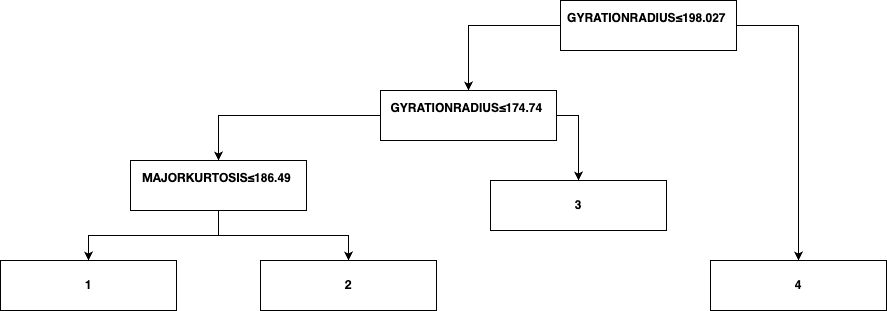

# py-explain-kmeans

Unofficial implementation of the paper 
"Explainable k-means. Don’t be greedy, plant bigger trees!"

> Makarychev, Konstantin, and Liren Shan. 
> "Explainable k-means: don’t be greedy, plant bigger trees!." 
> Proceedings of the 54th Annual ACM SIGACT Symposium on Theory of Computing. 2022.

This project primarily implements the data structures 
and algorithms from Explainable k-means and applies them to the Statlog Vehicle Silhouettes dataset.

>Dua, D. and Graff, C. (2019). 
> UCI Machine Learning Repository [http://archive.ics.uci.edu/ml]. 
> Irvine, CA: University of California, 
> School of Information and Computer Science.

Explain Tree result:

